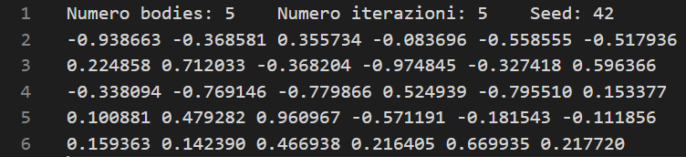
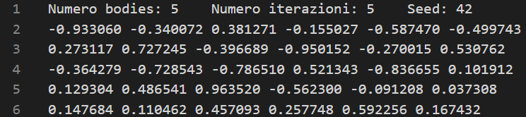
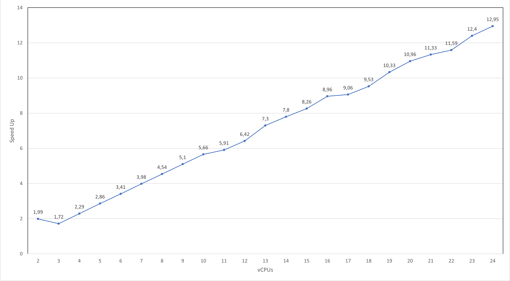
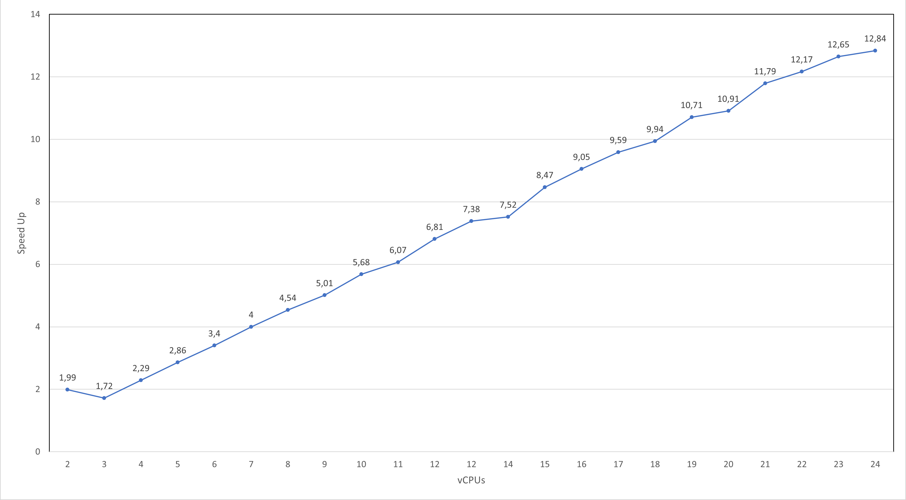
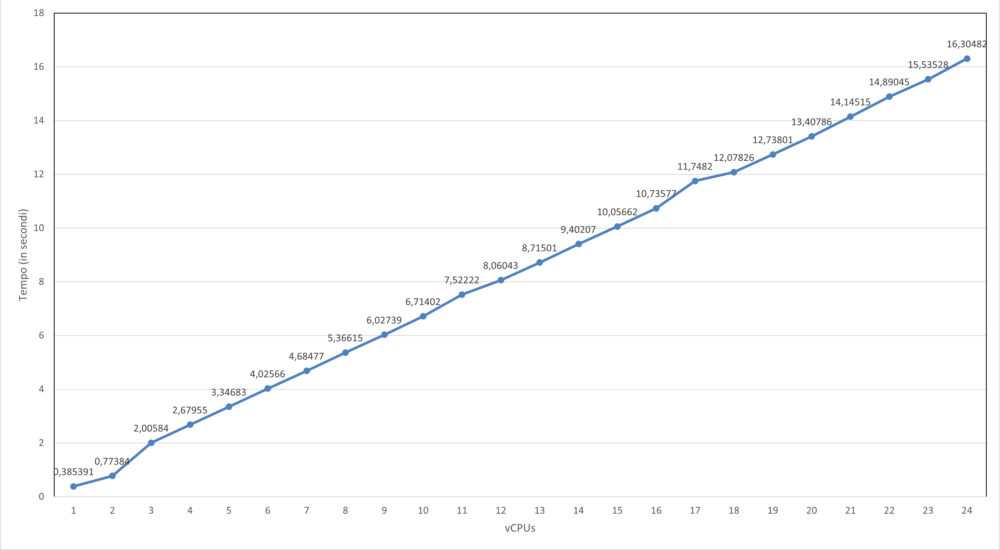

Casolaro Alessio
Matricola: 0522501326
#	Sommario
- [Sommario](#sommario)
- [Introduzione](#introduzione)
- [Soluzione proposta](#soluzione-proposta)
- [Dettagli implementativi](#dettagli-implementativi)
	- [Struttura per il tipo Body](#struttura-per-il-tipo-body)
	- [Inizializzazione bodies](#inizializzazione-bodies)
	- [Calcolo velocità e aggiornamento posizione bodies](#)
	- [Comunicazione](#comunicazione)
- [Istruzioni per l'esecuzione](#istruzioni-per-lesecuzione) 
- [Correttezza](#correttezza)
- [Benchmarks](#correttezza)
	- [Strong Scalability](#strong-scalability)
		- [Strong Scalability 10000 bodies](#strong-scalability-10000-bodies)
		- [Strong Scalability 20000 bodies](#strong-scalability-20000-bodies)
	- [Weak Scalability](#weak-scalability) 
- [Conclusioni](#conclusioni)

# Introduzione

Il problema degli **N-Body** è uno dei problemi più fertili della fisica matematica, affrontato multidisciplinarmente, consiste nel conoscere la posizione e la velocità di un insieme di corpi ( o bodies), i quali si influenzano tra loro, in un intervallo di tempo.
Per esempio, un astrofisico potrebbe voler conoscere la posizione a la velocità di una collezione di stelle, mentre un chimico potrebbe voler conoscere la posizione e la velocità di una collezione di molecole o atomi.
Una soluzione per N-Body è prodotta da un programma simulando il comportamento dei bodies. 
L'input del programma è un insieme di bodies, per cui vengono fornite:
- Le coordinate all'interno dello spazio
- La massa
- La velocità di movimento sui tre assi.

L'output restituisce l'insieme di bodies di input con posizioni e velocità aggiornate, rispetto all'influenza subita dagli altri.

# Soluzione proposta

Per risolvere questo problema è stata considerata la soluzione quadratica nel numero di bodies. Per la parte del calcolo della forza dei corpi, è stata seguita questa soluzione: [Soluzione sequenziale](https://github.com/harrism/mini-nbody/blob/master/nbody.c)

L'algoritmo proposto si occuperà di:
- Generare n bodies randomizzati salvandoli in un file
- Dividere i bodies generati in base al numero di processi
- Aggiornare posizioni e velocità dei bodies
- Salvare i bodies risultanti in un file di output

#	Dettagli implementativi
##	Struttura per il tipo Body
Per gestire tutti i bodies si è deciso di creare una struttura `Body` contenente le *coordinate dei bodies `x,y,z`* e la loro *velocità `vx,vy,vz`*:

    typedef struct {
    	float x, y, z, vx, vy, vz; 
    } Body;
    
Per permettere l'invio degli elementi della struttura con MPI, è stato necessario creare un nuovo tipo `body_type` 

    MPI_Datatype body_type, oldtype[1]; //body_type sara' il nuovo tipo
    oldtype[0] = MPI_FLOAT;
    int  blockcounts[1];
    blockcounts[0] = 6;//per i 6 campi della struttura Body
    MPI_Aint offset[1];
    offset[0] = 0;
    
    MPI_Type_create_struct(1, blockcounts, offset, oldtype, &body_type);
    MPI_Type_commit(&body_type);

##	Inizializzazione bodies
Per generare i bodies di partenza vengono chiesti all'utente 3 parametri da utilizzare per la simulazione:
- Numero di bodies
- Numero di iterazioni
- Seme randomico per la srand()

Viene richiamata la funzione `randomizeBodies` per la generazione random dei bodies sulla base del `seed` scelto in input.

    void  randomizeBodies(Body *body,int n_bodies,int seed)
    {
	    srand(seed);//Seme per la generazione random
	    for(int i = 0; i < n_bodies; i++){
		    body[i].x = 2.0f * (rand() / (float)RAND_MAX) - 1.0f;
		    body[i].y = 2.0f * (rand() / (float)RAND_MAX) - 1.0f;
	    	body[i].z = 2.0f * (rand() / (float)RAND_MAX) - 1.0f;
	    	body[i].vx = 2.0f * (rand() / (float)RAND_MAX) - 1.0f;
	    	body[i].vy = 2.0f * (rand() / (float)RAND_MAX) - 1.0f;
	    	body[i].vz = 2.0f * (rand() / (float)RAND_MAX) - 1.0f;
    	}
    }

I bodies randomizzati vengono salvati in un file `input.txt` dalla funzione `saveBodies`.

Una volta ottenuti i dati da utilizzare per la simulazione, viene stabilita la quantità di bodies gestita da ogni singolo core utilizzando gli array `sendcounts` e `displs` per la divisione in modo equo, che rappresentano:

 - `sendcounts`: *Numero di elementi* da gestire per core  
 - `displs`: Il *displacements* della posizione della partizione

Essi saranno ottenuti basandosi sul *numero di processi* utilizzato, sul *numero di bodies* e un eventuale *resto*.

    int rest = n_bodies % world_size;
    int lenght = n_bodies / world_size;
    int index = 0;
    for(int i=0; i<world_size; i++){
	    sendcounts[i] = lenght;
	    if(rest > 0){
		    rest--;
		    sendcounts[i] = sendcounts[i] + 1;
		}
	    displs[i] = index;
	    index += sendcounts[i];
    }

## Calcolo velocità e aggiornamento posizione bodies 
Ogni processore, ad ogni iterazione, ha il compito di calcolare la posizione e la velocità dei propri bodies.
La funzione `body_force` è usata per calcolare la velocità dei bodies sui tre assi a partire dalle posizioni degli stessi. 

    void  body_force(Body *body, float  dt, int  n_bodies, int  displs, int  sendcounts){
	    for(int i = displs; i < displs + sendcounts; i++){
		    float Fx = 0.0f; float Fy = 0.0f; float Fz = 0.0f;
		    for(int j = 0; j < n_bodies; j++){
			    float dx = body[j].x - body[i].x;
			    float dy = body[j].y - body[i].y;
			    float dz = body[j].z - body[i].z;
			    float distSqr = dx * dx + dy * dy + dz * dz + SOFTENING;
			    float invDist = 1.0f / sqrtf(distSqr);
			    float invDist3 = invDist * invDist * invDist;
			    
			    Fx += dx * invDist3;
			    Fy += dy * invDist3;
			    Fz += dz * invDist3;
		    }
	    
		    body[i].vx += dt*Fx;
		    body[i].vy += dt*Fy;
		    body[i].vz += dt*Fz;
		}
	}
Dopo aver aggiornato le velocità, vengono calcolate e aggiornate le nuove posizioni dei bodies.

    void  updateBodies(Body *body, float  dt, int  displs, int  sendcounts){
	    for(int i = displs; i < displs + sendcounts; i++){
		    //Aggiorno le posizioni
		    body[i].x += body[i].vx*dt;
		    body[i].y += body[i].vy*dt;
		    body[i].z += body[i].vz*dt;
    	}
    }

## Comunicazione 

    for(int i = 0; i < n_iter; i++){
	    //Aggiorno la velocita' dei bodies
	    body_force(body, dt, n_bodies, displs[world_rank], sendcounts[world_rank]);
    
	    //Aggiorno la posizione dei bodies usando le velocita' aggiornate
	    updateBodies(body, dt, displs[world_rank], sendcounts[world_rank]);
    
	    MPI_Allgatherv(MPI_IN_PLACE, sendcounts[world_rank], body_type, body, sendcounts, displs, body_type, MPI_COMM_WORLD); 
    }

Ogni processore calcola posizioni e velocità aggiornate per i propri bodies. 
Per combinare tutti i bodies e passare all'iterazione successiva è necessario utilizzare `MPI_Allgatherv`, rendendo disponibili le modifiche a tutti i processori.
La funzione `MPI_Allgatherv`, al contrario della sua variante `MPI_Allgather`, è particolarmente utile poiché permette di ricevere messaggi di diverse dimensioni utilizzando nella sua sintassi un `recvcounts` di tipo array.
La funzione fa una gather dei `body` e combina i dati nello stesso rendendo le modifiche disponibili a tutti.

    MPI_Allgatherv(MPI_IN_PLACE, sendcounts[world_rank], body_type, body, sendcounts, displs, body_type, MPI_COMM_WORLD);

# Istruzioni per l'esecuzione
Per la compilazione e l'esecuzione è necessario lanciare i seguenti comandi.

    mpicc nbody.c -o nbody.out -lm
    
    mpirun --allow-run-as-root --mca btl_vader_single_copy_mechanism none -np [numero_processi] nbody.out [numero_bodies] [numero_iterazioni] [seed]

Verranno generati due file:
-input.txt per visualizzare i bodies randomici generati sulla base degli input forniti.
-output.txt per visualizzare i valori aggiornati dei bodies.
In console verrà mostrato il `Tempo speso` per l'esecuzione dell'algoritmo.
#	Correttezza
Per dimostrare la correttezza dell'algoritmo sono state effettuate tre esecuzioni, dove in ogn'una di esse veniva cambiato il numero di processi coinvolti. Le immagini sottostanti riportano la generazione dei bodies in input, sempre uguali per le tre esecuzioni ottenuti utilizzando lo stesso seed. In output,  nonostante la variazione del numero di processi, vengono prodotti sempre gli stessi risultati.
*File di input - Numero Processi = 2*             |  *File di output - Numero Processi = 2*
:-------------------------:|:-------------------------:
  |  

*File di input - Numero Processi = 3*             |  *File di output - Numero Processi = 3*
:-------------------------:|:-------------------------:
 |  

*File di input - Numero Processi = 5*             |  *File di output - Numero Processi = 5*
:-------------------------:|:-------------------------:
  |  
#	Benchmarks
L'algoritmo è stato eseguito su **Google Cloud Platform** utilizzando 6 macchine virtuali **e2-standard-4** dotate 4 vCPUs e 16GB di Memoria RAM, per un totale di 24 vCPUs, al fine di osservare **Strong** e **Weak Scalabity** dello stesso.
##	Strong Scalability
Per osservare la Strong Scalability sono stati eseguiti due test, con 10000 e 20000 bodies, aumentando volta per volta il numero di vCPUs lasciando la taglia dell'input inalterata.

###	Strong Scalability 10000 bodies
|vCPUs|Tempo|Speed-up|
|-|-|-|
|1|9.58542|-
|2|4.80652|1,99|
|3|5.54988|1,72|
|4|4.18229|2,29|
|5|3.34485|2,86|
|6|2.80910|3,41|
|7|2.40736|3,98|
|8|2.11087|4,54|
|9|1.87779|5,10|
|10|1.69302|5,66|
|11|1.61986|5,91|
|12|1.49102|6,42|
|13|1.31291|7,30|
|14|1.22839|7,80|
|15|1.16000|8,26|
|16|1.06880|8,96|
|17|1.05689|9,06|
|18|1.00502|9,53|
|19|0.92709|10,33|
|20|0.87434|10,96|
|21|0.84539|11,33|
|22|0.82672|11,59|
|23|0.77273|12,40|
|24|0.73999|12,95|

###	Strong Scalability 20000 bodies
|vCPUs|Tempo|Speed-up|
|-|-|-|
| 1 | 38.19453 |-
| 2 | 19.19151 |1,99
| 3 | 22.17056 |1,72
| 4 | 16.65519 |2,29
| 5 | 13.33952 |2,86
| 6 | 11.22117 |3,40
| 7 | 9.54709 |4,00
| 8 | 8.40373 |4,54
| 9 | 7.61090 |5,01
| 10 | 6.72291 |5,68
| 11 | 6.28331 |6,07
| 12 | 5.60385 |6,81
| 12 | 5.16975 |7,38
| 14 | 5.07410 |7,52
| 15 | 4.50492 |8,47
| 16 | 4.21633 |9,05
| 17 | 3.97906 |9,59
| 18 | 3.83955 |9,94
| 19 | 3.56570 |10,71
| 20 | 3.49924 |10,91
| 21 | 3.23816 |11,79
| 22 | 3.13660 |12,17
| 23 | 3.01856 |12,65
| 24 | 2.97409 |12,84

*Strong Scalability 10000 Bodies*           |  *Strong Scalability 20000 Bodies*
:-------------------------:|:-------------------------:
  |  

##	Weak Scalability
Per valutare la Weak Scalability sono stati effettuati test aumentando la taglia dell'input in maniera uniforme rispetto al numero di processi, quindi si è fatto lavorare ogni vCPU con 2000 bodies, fino ad arrivare ad utilizzare 48000 bodies su 24 vCPUs.
|vCPUs|Tempo|Numero Bodies|
|-|-|-|
| 1  | 0.38539 | 2000   
| 2  | 0.77384 | 4000   |
| 3  | 2.00584 | 6000   |
| 4  | 2.67955 | 8000   |
| 5  | 3.34683 | 10000  |
| 6  | 4.02566 | 12000  |
| 7  | 4.68477 | 14000  |
| 8  | 5.36615 | 16000  |
| 9  | 6.02739 | 18000  |
| 10 | 6.71402 | 20000  |
| 11 | 7.52222 | 22000  |
| 12 | 8.06043 | 24000  |
| 13 | 8.71501 | 26000  |
| 14 | 9.40207 | 28000  |
| 15 | 10.05662 | 30000  |
| 16 | 10.73577 | 32000  |
| 17 | 11.74820 | 34000  |
| 18 | 12.07826 | 36000  |
| 19 | 12.73801 | 38000  |
| 20 | 13.40786 | 40000  |
| 21 | 14.14515 | 42000  |
| 22 | 14.89045 | 44000  |
| 23 | 15.53528 | 46000  |
| 24 | 16.30482 | 48000  |

*Weak Scalability*           | 
:-------------------------:|
  

# Conclusioni
Come è possibile osservare dai valori ottenuti e dai grafici risultanti l'algoritmo, nei benchmarks di valutazione della Strong Scalability, ha ottenuto un buon punteggio in termini di Speed Up, riuscendo a ridurre il tempo già con l'utilizzo di 2 vCPUs e mostrando un continuo decremento al crescere delle vCPUs.
In termini di Weak Scalability, l'algoritmo si è dimostrato non molto efficiente in quanto ci sono state crescite costanti nei tempi d'esecuzione.

